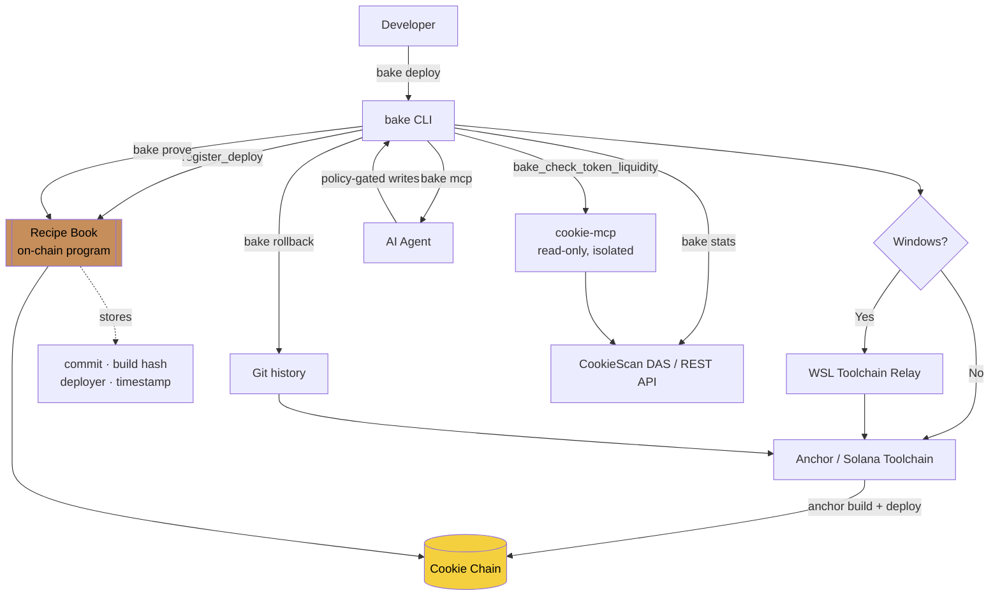

# bake 🍪

**The Vercel CLI for Cookie Chain.** Build, deploy, verify, and roll back Anchor programs in seconds — with every deploy permanently recorded on-chain.

```
   .-'''-.
  /  o  o \
 |  o    o     bake!
  \  o  o /
   `-...-'
```

[](https://www.npmjs.com/package/bakeacookie)
[](./LICENSE)

---

## Why bake exists

[Cookie Chain](https://www.cookiechain.wtf) is a fast, cheap, community-owned SVM blockchain — programs deploy for pennies with sub-second finality. But developer tooling on Cookie Chain today is almost entirely vanilla Solana CLI pointed at a different RPC endpoint. There's no deployment orchestration, no on-chain deploy history, no casual rollback, and no security-gated deploy flow — gaps the ecosystem's own roadmap lists as future work.

**bake closes that gap now.** Every command is designed around one idea: Cookie Chain's economics make things possible that are impractical anywhere else — like a rollback that costs cents, or a permanent, on-chain, queryable ledger of every deploy you've ever made.

## What makes bake different

- **On-chain deploy history.** Every `bake deploy` registers a permanent record — commit, build hash, deployer, timestamp — in a small on-chain Anchor program called the **Recipe Book**. Nothing else in the ecosystem does this.
- **Cross-platform by default.** Anchor/Solana's build toolchain doesn't run natively on Windows — even the official Anchor CLI needs WSL. `bake` auto-detects native Windows and transparently relays toolchain-dependent commands through WSL, so Windows developers get the same one-command experience as macOS/Linux, without manually bridging shells.
- **Cheap, honest rollback.** `bake rollback` rebuilds and redeploys a previous commit, verified with a git-state safety net that's been tested against deliberate mid-operation failures — your working directory is never left in a broken state.
- **Cryptographic proof, not just trust.** `bake prove` verifies that what's actually running on-chain matches what your Recipe Book says was deployed, using real ELF-binary hash comparison — not a guess.
- **Agent-native.** `bake mcp` exposes bake's capabilities to AI agents over the Model Context Protocol, with a safety-first design: write operations (deploy, rollback) are completely invisible to an agent unless an explicit policy file enables them, and even then require a second confirming call before executing.
- **Security-gated deploys, honestly sourced.** `bake audit` runs [Radar](https://github.com/auditware/radar) — Auditware's static analyzer for Anchor/Rust contracts, the tool the Solana docs recommend — and `bake deploy --require-audit` refuses to ship critical or high findings. bake ships **no hand-rolled security heuristics**: every finding is Radar's, labelled "powered by Radar".
- **Genuinely cross-chain, not just architecturally.** The full pipeline (deploy, prove, logs, stats) has been tested end-to-end on Solana devnet, not just Cookie Chain, with zero code changes required.

## Install

```bash
npm install -g bakeacookie
```

The package is published as `bakeacookie` (the shorter names were already taken), but the command you run is just:

```bash
bake --help
```

**Windows users:** bake needs a Solana/Anchor toolchain available via WSL for build/deploy commands. Run `bake doctor` after install to check your environment.

## Requirements

Not every command needs the full toolchain — `bake login`, `bake use`, `bake whoami`, `bake stats`, `bake logs`, and `bake decode` work with just Node.js. For build/deploy commands you'll also need Rust, Solana CLI, and Anchor (or WSL on Windows). `bake audit` additionally requires [Radar](https://github.com/auditware/radar) plus a running Docker daemon (bake prints the one-line Radar install command if it's missing — it never installs a security scanner for you silently). See [REQUIREMENTS.md](./REQUIREMENTS.md) for the full breakdown by use case.

## Quickstart

```bash
bake login                 # creates or links a local wallet — zero ceremony
bake use cookie             # point at Cookie Chain (or: mainnet, devnet, a local validator URL)
bake init my-program        # scaffold a new Anchor project, pre-wired for Cookie Chain
cd my-program
bake deploy                 # build → deploy → hash → register on-chain, all in one command
bake logs -f                # watch it live
```

## Command reference

| Command | Description |
|---|---|
| `bake login` | Local keypair by default (zero ceremony); `--wallet nightly` for high-stakes confirmations |
| `bake use [cluster\|url]` | Switch active cluster (`cookie`, `mainnet`, `devnet`, or any RPC URL) |
| `bake whoami` | Show active wallet(s) and cluster |
| `bake init [name]` | Scaffold a new Anchor project pre-wired for Cookie Chain |
| `bake deploy` | Build, deploy, hash, and register the deploy in the on-chain Recipe Book; `--require-audit` gates on `bake audit`. After deploying, view your deploy history on the [dashboard](https://bakeacookie.vercel.app/program/<program-id>) |
| `bake audit [path]` | Static analysis for Anchor programs (wraps Radar) — flags high-severity findings; `bake deploy --require-audit` gates deploys on a clean scan |
| `bake rollback [entry]` | Rebuild and redeploy a previous Recipe Book entry; `--program <addr>` to skip Anchor.toml detection |
| `bake logs [programId]` | View recent or live-streamed (`-f`) program logs, with Anchor event decoding |
| `bake prove [entry]` | Verify on-chain bytecode matches a Recipe Book entry; `--rebuild` for full proof; `--program <addr>` to skip Anchor.toml detection |
| `bake diff [entry]` | Show what's changed (source and, with `--rebuild`, bytecode) since a given deploy |
| `bake decode <sig\|--account>` | Decode a transaction or account using a program's IDL |
| `bake stats [programId]` | Program activity (invocations, error rate, unique signers, CU) plus CookieScan network context |
| `bake fork <programId>` | Clone a program (and optionally its accounts) from any cluster into a local validator |
| `bake doctor` | Full environment health check (Node, git, WSL, wallet, cluster, balance, project) |
| `bake dashboard [address]` | Open the web dashboard in your browser — `/program/<address>` with arg, homepage without; `--ci` prints URL instead of launching browser |
| `bake mcp` | Run bake as an MCP server for AI agents, with policy-gated write access |

Every command supports `--ci` (plain, color-free output) and `--json` (structured output for scripting).

## How it works



## Architecture

- `src/commands/` — one file per CLI command
- `src/lib/deployPipeline.ts` — the single, shared build→deploy→hash→register implementation used by both `deploy` and `rollback`; also configures the Solana CLI target (`solana config set --url`) before every real deploy to prevent Anchor from silently targeting localhost
- `src/lib/toolchain.ts` — cross-platform Anchor/Solana subprocess runner, including the Windows→WSL relay
- `src/lib/recipeBook.ts` — Recipe Book client (real, on-chain) with a mock implementation for testing command orchestration
- `src/idl/recipe_book.json` — hand-written, live-validated IDL (a durable fallback alongside auto-generation)
- `anchor/programs/recipe_book/` — the on-chain Recipe Book Anchor program
- `src/lib/mcpServer.ts` / `mcpPolicy.ts` — the MCP server and its write-policy gating
- See [AGENTS.md](./AGENTS.md) for detailed internals, known toolchain gotchas, and the full failure-signature reference gathered during development.

## Vision & Roadmap

What's shipped today already turns Cookie Chain's cost/speed advantage into daily muscle memory. Where this is headed:

- **`bake fork` enhancements** — deeper Solana mainnet rehearsal workflows
- **`bake doctor` → `bake session`** — disposable, ephemeral deploy workspaces (open → deploy → close/settle)
- **Multisig-first upgrades** — `bake deploy --authority multisig`, proposal/execution flow
- **`bake agent init`** — scaffold a minimal agent wired to bake + [cookie-mcp](https://github.com/cookiechain/cookie-mcp)
- **`bake top`** — deferred (would require chain-wide indexing infrastructure beyond a CLI's reasonable scope for now)
- **`bake dashboard`** — open the companion web dashboard in your browser (`bakeacookie.vercel.app`), with CI-safe URL printing
- **Companion web dashboard** — wallet-connected visualization of your Recipe Book deploy history — live at [bakeacookie.vercel.app](https://bakeacookie.vercel.app)

The goal: if you're deploying a program on Cookie Chain, you should be using bake.

## Companion dashboard

A web dashboard for visualizing Recipe Book deploy history, connected via Nightly wallet: **[bakeacookie.vercel.app](https://bakeacookie.vercel.app)**. View any program's deploy history at `/program/<program-id>`.

## Contributing

Issues and PRs welcome. Read [AGENTS.md](./AGENTS.md) first if you're using an AI coding agent to contribute — it documents hard-won toolchain constraints that are easy to accidentally re-break.

## License

MIT
